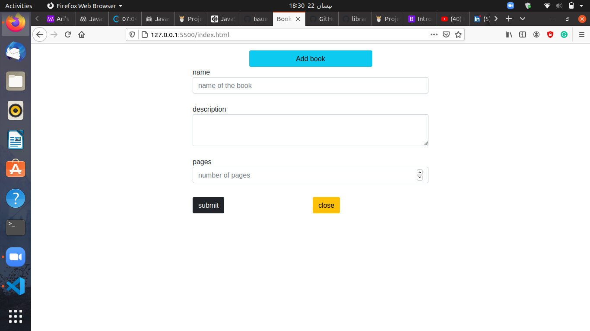

# Book-library

Book-Library project, a user can create a book with name, description and number of pages.

  

## Screenshots of the app.

## Built With

- HTML/CSS
- Bootstrap
- Javascript

## Prerequisities

To get this project up and running locally, you must follow the steps from the [getting started section](#getting-started).

## Getting Started

**To get this project set up on your local machine, follow these simple steps:**

**Step 1** 
Navigate through the local folder where you want to clone the repository and run 
git clone `https://github.com/arikarim/Book-library/tree/main`. It will clone the repo to your local folder. 

**Step 2** 
then you can run it using the text editor of your choice.

## 🤝 contributing

contributions, issues, and feature requests are welcome! feel free to check [issues page](https://github.com/arikarim/Book-library/issues).

## Author

- GitHub: [@arikarim](https://github.com/arikarim)
- LinkedIn: [AriKarim](https://www.linkedin.com/in/ari-karim-523bb81b3)

## 🙋‍♂ show your support

give a ⭐️ if you like this project!

## 📝 license

This project is [MIT](LICENSE) licensed.

